  

  </img>
  </img>

## 🌟 I'm **惜月**

- 🐍Amateur Python Programmer.
- 🔧Working in Zhuhai, China.
- 🤖Passionate about Developing [Python Chatbot](https://github.com/nonebot/nonebot2) related Projects.
- ✏️Learning Python/Node.js/Java/Linux/database etc.

## 📖 **Learning**

- [NoneBot2](https://github.com/nonebot/nonebot2) - A Python asynchronous cross-platform chatbot framework.
- [cherry-orm](https://github.com/CMHopeSunshine/cherry-orm) - Python asynchronous ORM based on SQLAlchemy and Pydantic.
- [unqdantic](https://github.com/CMHopeSunshine/unqdantic) - Python embedded NoSQL database ODM based on UnQLite. 
- [LittlePaimon](https://github.com/CMHopeSunshine/LittlePaimon) - A MiHoYo Game Chatbot based on NoneBot2.
- [nonebot-adapter-discord](https://github.com/nonebot/adapter-discord) - Discord Adapter for NoneBot2.
- [nonebot-adapter-dodo](https://github.com/nonebot/adapter-dodo) - DoDo Adapter for NoneBot2.
- [nonebot-adapter-villa](https://github.com/CMHopeSunshine/nonebot-adapter-villa) - MiHoYo Villa Adapter for NoneBot2.
- [Villa](https://github.com/CMHopeSunshine/villa-py) - Python SDK for MiHoYo Villa.
- [amis-python](https://github.com/CMHopeSunshine/amis-python) - Python encapsulation based on Baidu Amis front-end framework.
- And some plugins for NoneBot2...

## 🌍 **Environment**

## 🎮 Playing **Games**

- Honkai Star Rail
- Genshin Impact
- Pokemon
- League of Legends
- Teamfight Tactic
- PUBG
- ...

